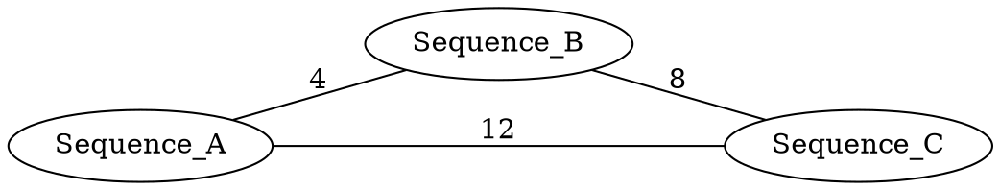

# Projet MPI : Classification et Clustering de Séquences d'ARN

## Introduction

Ce projet implémente un pipeline complet d'analyse de séquences biologiques (ARN/ADN) utilisant des algorithmes de graphe et de clustering distribués avec MPI.

Le pipeline comprend trois étapes principales :
1. **Calcul des distances** entre séquences (Levenshtein, Hamming)
2. **Calcul des plus courts chemins** avec Floyd-Warshall parallèle
3. **Clustering des séquences** avec l'algorithme PAM (Partitioning Around Medoids)

## Architecture du Projet

Le projet est organisé en trois modules principaux :

### Module ARN
- Lecture de séquences au format FASTA
- Calcul de matrices de distances (Levenshtein, Hamming)
- Construction de graphes pondérés au format DOT
- Intégration avec Floyd-Warshall et PAM

### Module Floyd-Warshall
- Implémentation séquentielle classique
- Implémentation parallèle par blocs (MPI)
- Lecture de graphes au format DOT (Graphviz)
- Calcul de la matrice des plus courts chemins

### Module PAM (K-Medoids)
- Algorithme PAM séquentiel
- Algorithme PAM distribué (MPI)
- Clustering basé sur une matrice de distances

## Installation et Compilation

### Prérequis

- **Compilateur C++11** : g++ ≥ 4.8 ou clang++ ≥ 3.3
- **MPI** : OpenMPI ≥ 1.8 ou MPICH ≥ 3.0
- **Graphviz** : libcgraph (pour la lecture des fichiers .dot)
- **Make** : GNU Make

Installation des dépendances sur Ubuntu/Debian :
```bash
sudo apt-get install build-essential libopenmpi-dev libgraphviz-dev
```

### Compilation

Compiler chaque module individuellement :

```bash
# Module Floyd-Warshall
cd Floyd
make

# Module PAM
cd ../PAM
make

# Module ARN (pipeline complet)
cd ../ARN
make
```

## Utilisation

### Floyd-Warshall MPI

Calcule la matrice des plus courts chemins d'un graphe :

```bash
mpirun -np <P> ./mpi_floyd <graphe.dot>
```

**Paramètres** :
- `<P>` : Nombre de processus MPI (doit être un carré parfait : 4, 9, 16, 25...)
- `<graphe.dot>` : Fichier graphe au format DOT

**Contraintes** :
- Le nombre de nœuds du graphe doit être divisible par √P

**Exemple** :
```bash
mpirun -np 4 ./mpi_floyd Exemple_7noeuds.dot
```

### PAM (K-Medoids)

Effectue un clustering PAM sur un graphe :

```bash
# Version séquentielle
./pam <graphe.dot> <k> [seed]

# Version MPI
mpirun -np <P> ./pam_mpi <graphe.dot> <k> [seed]
```

**Paramètres** :
- `<graphe.dot>` : Fichier graphe au format DOT
- `<k>` : Nombre de clusters désirés
- `[seed]` : Graine aléatoire (optionnel, défaut : 12345)

**Exemple** :
```bash
mpirun -np 4 ./pam_mpi ../Exemple2.dot 3
```

### Pipeline ARN Complet

Analyse complète de séquences d'ARN avec clustering :

```bash
mpirun -np <P> ./arn_main <fichier.fasta> <epsilon> <k> [output.dot]
```

**Paramètres** :
- `<fichier.fasta>` : Fichier de séquences au format FASTA
- `<epsilon>` : Seuil de distance pour créer une arête dans le graphe
- `<k>` : Nombre de clusters pour PAM
- `[output.dot]` : Fichier de sortie (optionnel, défaut : arn_graph.dot)

**Exemple** :
```bash
mpirun -np 4 ./arn_main sequences.fasta 15 3 results.dot
```

## Formats de Fichiers

### Format FASTA

Format d'entrée pour les séquences biologiques :

```
>Sequence_A
ACGTACGTTAGCTAGC
>Sequence_B
ACGTTAGCTAGCTAGC
>Sequence_C
TGCATGCATGCATGCA
```

- Les lignes commençant par `>` contiennent les labels/identifiants
- Les lignes suivantes contiennent la séquence (A, C, G, T/U)
- Les séquences peuvent s'étendre sur plusieurs lignes

### Format DOT (Graphviz)

Format de graphe utilisé en entrée/sortie :



Visualisation du graphe :
```bash
dot -Tpng output.dot -o output.png
dot -Tpdf output.dot -o output.pdf
```

## Algorithmes Implémentés

### Distance de Levenshtein

Calcule le nombre minimum d'opérations d'édition (insertion, suppression, substitution) nécessaires pour transformer une séquence en une autre.

- **Complexité** : O(m × n) où m et n sont les longueurs des séquences
- **Utilisation** : Séquences de longueurs différentes

### Distance de Hamming

Compte le nombre de positions où deux séquences diffèrent.

- **Complexité** : O(n) où n est la longueur des séquences
- **Contrainte** : Séquences de même longueur uniquement

### Floyd-Warshall

Calcule les plus courts chemins entre toutes les paires de nœuds d'un graphe.

- **Complexité séquentielle** : O(n³)
- **Complexité parallèle** : O(n³/P) avec P processus (théorique)
- **Parallélisation** : Découpage en blocs avec communications MPI

### PAM (Partitioning Around Medoids)

Algorithme de clustering qui sélectionne k objets représentatifs (médoïdes) et affecte chaque objet au médoïde le plus proche.

- **Complexité** : O(k × n² × iter) où iter est le nombre d'itérations
- **Avantage** : Robuste aux outliers (contrairement à k-means)

## Parallélisation MPI

### Floyd-Warshall par Blocs

Le graphe est découpé en blocs carrés de taille (n/√P) × (n/√P).

Pour chaque itération k :
1. Le processus pivot (k,k) calcule son bloc
2. Broadcast du bloc pivot sur sa ligne et colonne
3. Mise à jour des blocs de la ligne k et colonne k
4. Mise à jour des autres blocs

**Communications** :
- `MPI_Comm_split` : création de communicateurs ligne/colonne
- `MPI_Bcast` : diffusion des blocs
- `MPI_Barrier` : synchronisation entre phases

### PAM Distribué

La matrice de distances est distribuée par lignes entre les processus.

Pour chaque tentative d'échange (médoïde ↔ candidat) :
1. Chaque processus calcule le delta local
2. `MPI_Allreduce` pour obtenir le delta global
3. Application de l'échange si bénéfique
4. `MPI_Bcast` des nouveaux médoïdes

## Performances

### Scalabilité

| Algorithme      | Complexité Séq. | Complexité Par. | Speedup Idéal |
|-----------------|-----------------|-----------------|---------------|
| Levenshtein     | O(m·n)          | -               | -             |
| Floyd-Warshall  | O(n³)           | O(n³/P)         | P             |
| PAM             | O(k·n²·iter)    | O(k·n²·iter/P)  | P             |

### Goulets d'Étranglement

- **Communications MPI** : Surcoût non négligeable pour petits graphes
- **Synchronisation** : Barrières entre phases Floyd-Warshall
- **Mémoire** : Chaque processus doit stocker au moins un bloc (n/√P)²
- **Déséquilibre** : Si n non divisible par √P

### Conseils d'Optimisation

1. **Choisir P = carré parfait** pour Floyd-Warshall
2. **n divisible par √P** pour équilibrage optimal
3. **Minimiser les itérations PAM** avec bonne initialisation
4. **Utiliser InfiniBand** pour communications rapides
5. **Compiler avec -O3** pour optimisations du compilateur

## Exemples d'Utilisation

### Workflow Complet

```bash
# 1. Créer un fichier FASTA de test
cat > sequences.fasta << EOF
>Seq_A
ACGTACGTTAGCTAGC
>Seq_B
ACGTTAGCTAGCTAGC
>Seq_C
TGCATGCATGCATGCA
>Seq_D
ACGTACGTACGTACGT
EOF

# 2. Exécuter le pipeline complet avec 4 processus
mpirun -np 4 ./arn_main sequences.fasta 10 2 results.dot

# 3. Visualiser le graphe résultant
dot -Tpng results.dot -o results.png
xdg-open results.png
```

### Floyd-Warshall Seul

```bash
# Analyser un graphe existant
mpirun -np 9 ./mpi_floyd Floyd/Exemple_100noeuds.dot
```

### PAM Seul

```bash
# Clustering avec 3 clusters
mpirun -np 4 ./pam_mpi Exemple2.dot 3 42
```

## Tests

### Exécuter les Tests

Chaque module possède une cible `test` dans son Makefile :

```bash
# Test Floyd-Warshall
cd Floyd
make test

# Test PAM
cd ../PAM
make test

# Test ARN
cd ../ARN
make test
```

### Validation des Résultats

Pour vérifier la cohérence entre version séquentielle et parallèle :

```bash
# Comparer Floyd séquentiel vs parallèle
./mpi_floyd graphe.dot > seq.txt
mpirun -np 4 ./mpi_floyd graphe.dot > par.txt
diff seq.txt par.txt
```

## Limitations Connues

1. **Contrainte P = carré parfait** pour Floyd-Warshall
   - Solution future : découpage rectangulaire

2. **Valeur INF fixée à 1000**
   - Peut causer des problèmes si poids > 1000
   - Solution : utiliser INT_MAX avec gestion overflow

3. **Pas de gestion mémoire distribuée**
   - Chaque processus doit pouvoir charger sa partie
   - Solution : out-of-core algorithms pour très grands graphes

4. **PAM peut converger vers optimum local**
   - Dépend de l'initialisation aléatoire
   - Solution : multiple restarts avec différentes graines

## Améliorations Futures

### Algorithmes
- Implémentation de k-means pour comparaison avec PAM
- Support d'autres distances (DTW pour séries temporelles)
- Algorithmes approximatifs : CLARANS, FastPAM
- Clustering hiérarchique (UPGMA, Neighbor-Joining)

### Performances
- Parallélisation GPU avec CUDA
- Optimisation SIMD pour calcul de distances
- Compression de la matrice (graphes creux)
- Checkpointing pour longues exécutions

### Fonctionnalités
- Interface Python (bindings pybind11)
- Visualisation interactive (D3.js)
- Export vers formats standards (Newick, Nexus)
- Support de séquences protéiques (BLOSUM62)

## Contribution

### Style de Code
- C++11 standard
- Indentation : 4 espaces
- Documentation : Doxygen
- Tests unitaires requis

### Processus
1. Fork du projet
2. Créer une branche feature
3. Commiter les changements
4. Pousser vers la branche
5. Ouvrir une Pull Request

## Licence

Ce projet est distribué sous licence MIT.

## Auteurs

- Projet MPI 2025
- Contributeurs : [Liste à compléter]

## Références

- Floyd, R. W. (1962). Algorithm 97: Shortest path. Communications of the ACM.
- Kaufman, L., & Rousseeuw, P. J. (1990). Finding Groups in Data: An Introduction to Cluster Analysis.
- Levenshtein, V. I. (1966). Binary codes capable of correcting deletions, insertions, and reversals.
- MPI Forum. MPI: A Message-Passing Interface Standard. Version 3.1.

## Contact

Pour toute question ou suggestion :
- Issues GitHub : [URL du projet]
- Email : [email à compléter]

---

> **Note** : Ce projet nécessite une bonne compréhension des concepts de programmation parallèle et des algorithmes de graphe. Pour une introduction, consulter les références citées.

> **Attention** : Les graphes de très grande taille (n > 10000) peuvent nécessiter des ressources importantes. Tester d'abord avec de petits exemples.