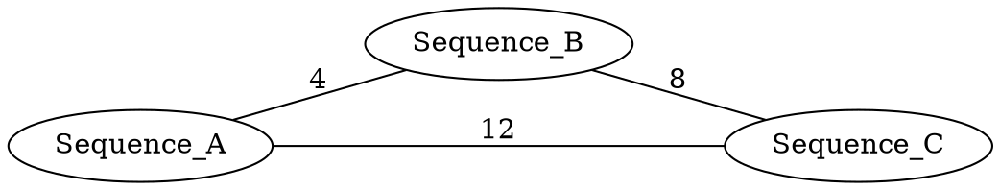
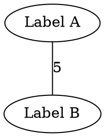
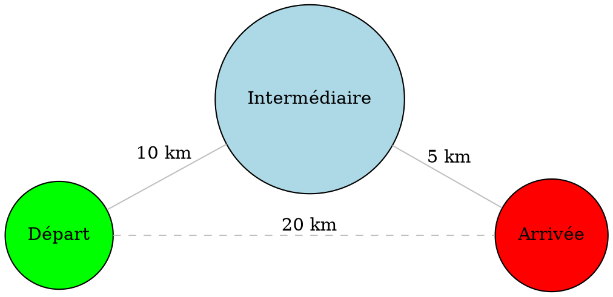

# 🧬 Projet MPI : Classification et Clustering de Séquences d'ARN

[](https://github.com/votre-repo)
[](LICENSE)
[](https://www.mpi-forum.org/)

## 📋 Table des matières

- [Introduction](#-introduction)
- [Architecture du projet](#-architecture-du-projet)
- [Prérequis et installation](#-prérequis-et-installation)
- [Guide de compilation](#-guide-de-compilation)
- [Guide d'exécution](#-guide-dexécution)
  - [Module Floyd-Warshall](#1-module-floyd-warshall)
  - [Module PAM](#2-module-pam)
  - [Module ARN (Pipeline complet)](#3-module-arn-pipeline-complet)
- [Formats de fichiers](#-formats-de-fichiers)
- [Algorithmes implémentés](#-algorithmes-implémentés)
- [Exemples pratiques](#-exemples-pratiques)
- [Tests et validation](#-tests-et-validation)
- [Optimisation et performances](#-optimisation-et-performances)
- [Dépannage](#-dépannage)
- [Contribution](#-contribution)
- [Références](#-références)

---

## 🎯 Introduction

Ce projet implémente un **pipeline complet d'analyse bioinformatique** pour classifier et regrouper des séquences biologiques (ARN/ADN) en utilisant des algorithmes parallèles distribués avec **MPI** (Message Passing Interface).

### 🔬 Cas d'usage

- **Bioinformatique** : Classification de variants génétiques
- **Épidémiologie** : Analyse de mutations virales (COVID-19, grippe)
- **Phylogénétique** : Construction d'arbres évolutifs
- **Recherche génomique** : Identification de familles de gènes

### 🚀 Pipeline en 3 étapes

```
┌─────────────────┐
│  Séquences ARN  │  (Format FASTA)
│   A, C, G, T    │
└────────┬────────┘
         │
         ▼
┌─────────────────────────────┐
│  ÉTAPE 1 : Calcul distances │
│  • Levenshtein (édition)    │
│  • Hamming (substitution)   │
└────────┬────────────────────┘
         │
         ▼
┌─────────────────────────────┐
│  ÉTAPE 2 : Floyd-Warshall   │
│  Plus courts chemins (MPI)  │
│  Découpage en blocs √P×√P   │
└────────┬────────────────────┘
         │
         ▼
┌─────────────────────────────┐
│  ÉTAPE 3 : Clustering PAM   │
│  K-médoïdes distribué (MPI) │
│  Identification de groupes  │
└────────┬────────────────────┘
         │
         ▼
┌─────────────────────────────┐
│  Résultats : Graphe + Stats │
│  • Fichier DOT (Graphviz)   │
│  • Médoïdes par cluster     │
│  • Visualisation PNG/PDF    │
└─────────────────────────────┘
```

---

## 📁 Architecture du projet

```
Projet_MPI_ARN/
│
├── ARN/                          # Module traitement séquences
│   ├── ARNSequence.hpp           # Structures et prototypes
│   ├── ARNSequence.cpp           # Implémentation distances
│   ├── main_arn.cpp              # Pipeline complet MPI
│   ├── Makefile                  # Compilation module ARN
│   ├── Doxyfile                  # Configuration Doxygen
│   └── README.md                 # Documentation ARN
│
├── Floyd/                        # Module Floyd-Warshall
│   ├── ForGraph.hpp              # Lecture graphes DOT
│   ├── ForGraph.cpp              # Implémentation lecture
│   ├── FoydPar.hpp               # Floyd parallèle (prototypes)
│   ├── FoydPar.cpp               # Floyd par blocs MPI
│   ├── Utils.hpp/cpp             # Utilitaires affichage
│   ├── main.cpp                  # Exécutable Floyd standalone
│   ├── Makefile                  # Compilation Floyd
│   ├── Exemple_7noeuds.dot       # Graphe test petit
│   └── Exemple_100noeuds.dot     # Graphe test grand
│
├── PAM/                          # Module PAM (K-médoïdes)
│   ├── PAM.hpp                   # Prototypes PAM
│   ├── PAM.cpp                   # Implémentation séq. + MPI
│   ├── main_pam.cpp              # Exécutable PAM standalone
│   ├── Makefile                  # Compilation PAM
│   └── Doxyfile                  # Configuration Doxygen
│
└── README.md                     # Ce fichier (documentation globale)
```

### 🔗 Dépendances entre modules

```
ARN ──────┬──────> Floyd (lecture graphe, calcul chemins)
          │
          └──────> PAM (clustering sur distances)

Floyd ────────────> Graphviz (lecture .dot)

PAM ───────────────> Floyd (lecture graphe optionnelle)
```

---

## 🛠 Prérequis et installation

### Système d'exploitation

- ✅ Linux (Ubuntu 20.04+, Debian 11+, CentOS 8+)
- ✅ macOS (avec Homebrew)
- ⚠️ Windows (WSL2 recommandé)

### Dépendances requises

| Logiciel | Version minimale | Installation Ubuntu/Debian |
|----------|------------------|----------------------------|
| **GCC** | 4.8+ | `sudo apt install build-essential` |
| **OpenMPI** | 1.8+ | `sudo apt install libopenmpi-dev openmpi-bin` |
| **Graphviz** | 2.40+ | `sudo apt install libgraphviz-dev graphviz` |
| **Make** | 3.81+ | `sudo apt install make` |
| **Doxygen** (optionnel) | 1.8+ | `sudo apt install doxygen` |

### Installation complète (Ubuntu/Debian)

```bash
# Mise à jour du système
sudo apt update && sudo apt upgrade -y

# Installation des dépendances
sudo apt install -y \
    build-essential \
    libopenmpi-dev \
    openmpi-bin \
    libgraphviz-dev \
    graphviz \
    make \
    doxygen \
    git

# Vérification des installations
gcc --version          # >= 4.8
mpicc --version        # OpenMPI
dot -V                 # Graphviz
make --version         # GNU Make
```

### Installation macOS (Homebrew)

```bash
# Installation Homebrew (si nécessaire)
/bin/bash -c "$(curl -fsSL https://raw.githubusercontent.com/Homebrew/install/HEAD/install.sh)"

# Installation des dépendances
brew install gcc open-mpi graphviz make doxygen

# Vérification
mpicc --version
dot -V
```

### Téléchargement du projet

```bash
# Cloner le dépôt
git clone https://github.com/votre-repo/projet-mpi-arn.git
cd projet-mpi-arn

# Ou télécharger l'archive
wget https://votre-url/projet-mpi-arn.tar.gz
tar -xzvf projet-mpi-arn.tar.gz
cd projet-mpi-arn
```

---

## 🔨 Guide de compilation

### Compilation globale (tous les modules)

```bash
# Depuis la racine du projet
./build_all.sh

# Ou manuellement
cd Floyd && make && cd ..
cd PAM && make && cd ..
cd ARN && make && cd ..
```

### Compilation par module

#### 1️⃣ Module Floyd-Warshall

```bash
cd Floyd
make clean          # Nettoyer les anciens fichiers
make                # Compilation

# Vérification
ls -lh mpi_floyd    # Exécutable créé
```

**Fichiers générés** :
- `mpi_floyd` : Exécutable MPI principal
- `*.o` : Fichiers objets intermédiaires

**Options de compilation** :
```bash
make CFLAGS="-O3 -march=native"  # Optimisation maximale
make DEBUG=1                      # Version debug avec -g
```

#### 2️⃣ Module PAM

```bash
cd PAM
make clean
make

# Génère deux exécutables
ls -lh pam          # Version séquentielle
ls -lh pam_mpi      # Version MPI
```

#### 3️⃣ Module ARN (Pipeline complet)

```bash
cd ARN
make clean
make

# Vérification
ls -lh arn_main     # Exécutable pipeline complet
```

**⚠️ Important** : Le module ARN dépend de Floyd et PAM. Compilez-les d'abord !

### Génération de la documentation

```bash
# Dans chaque module
cd Floyd
doxygen Doxyfile
firefox doc/html/index.html  # Ouvrir la doc

cd ../PAM
doxygen Doxyfile

cd ../ARN
doxygen Doxyfile
```

### Résolution des problèmes de compilation

#### Erreur : `mpi.h not found`
```bash
# Ubuntu/Debian
sudo apt install libopenmpi-dev

# Vérifier chemin
mpicc --showme:compile
```

#### Erreur : `cgraph.h not found`
```bash
# Installer Graphviz dev
sudo apt install libgraphviz-dev

# Ou spécifier le chemin
make INCLUDES="-I/usr/include/graphviz"
```

#### Erreur : Undefined reference to `MPI_*`
```bash
# Vérifier que mpic++ est utilisé
which mpic++
# Recompiler avec
make CXX=mpic++
```

---

## 🚀 Guide d'exécution

### 1️⃣ Module Floyd-Warshall

#### 🎯 Objectif
Calculer la **matrice des plus courts chemins** entre tous les sommets d'un graphe pondéré.

#### 📝 Syntaxe

```bash
mpirun -np <P> ./mpi_floyd <fichier_graphe.dot>
```

#### 📋 Paramètres

| Paramètre | Description | Contraintes |
|-----------|-------------|-------------|
| `<P>` | Nombre de processus MPI | **Doit être un carré parfait** (4, 9, 16, 25, 36...) |
| `<fichier.dot>` | Graphe au format Graphviz DOT | Nombre de nœuds divisible par √P |

#### ✅ Exemples d'exécution

**Exemple 1 : Petit graphe (6 nœuds, 4 processus)**

```bash
cd Floyd

# Exécution avec 4 processus (2×2)
mpirun -np 4 ./mpi_floyd Exemple_7noeuds.dot

# Sortie attendue :
# === Matrice d'adjacence ===
# ...
# === Matrice de distances initiale ===
# ...
# === Matrice de distances (séquentiel) ===
# ...
# Temps séquentiel : 0.000123 sec
# === Matrice globale après Floyd par blocs MPI ===
# ...
# Temps parallèle : 0.000456 sec
```

**Exemple 2 : Grand graphe (100 nœuds, 16 processus)**

```bash
# Avec 16 processus (4×4)
mpirun -np 16 ./mpi_floyd Exemple_100noeuds.dot

# Rediriger la sortie vers un fichier
mpirun -np 16 ./mpi_floyd Exemple_100noeuds.dot > resultats.txt
```

**Exemple 3 : Exécution sur cluster**

```bash
# Fichier hostfile (liste des machines)
cat > hostfile << EOF
node1 slots=4
node2 slots=4
node3 slots=4
node4 slots=4
EOF

# Exécution distribuée
mpirun -np 16 --hostfile hostfile ./mpi_floyd graphe_large.dot
```

#### 📊 Interpréter les résultats

La sortie contient trois matrices :

1. **Matrice d'adjacence** : Poids directs des arêtes
   ```
   === Matrice d'adjacence ===
       0  1  2  3
   0   0  5  0  0
   1   5  0  3  0
   2   0  3  0  7
   3   0  0  7  0
   ```

2. **Matrice initiale** : Avec INF pour chemins inexistants
   ```
   === Matrice de distances initiale ===
       0    1    2    3
   0   0    5  INF  INF
   1   5    0    3  INF
   2 INF    3    0    7
   3 INF  INF    7    0
   ```

3. **Matrice finale** : Plus courts chemins
   ```
   === Matrice globale après Floyd par blocs MPI ===
       0  1  2  3
   0   0  5  8 15
   1   5  0  3 10
   2   8  3  0  7
   3  15 10  7  0
   ```

**Lecture** : La distance minimale du nœud 0 au nœud 3 est **15**.

#### ⚙️ Contraintes techniques

1. **P doit être un carré parfait**
   ```bash
   # ✅ Valide
   mpirun -np 4 ./mpi_floyd ...   # 2×2
   mpirun -np 9 ./mpi_floyd ...   # 3×3
   mpirun -np 16 ./mpi_floyd ...  # 4×4
   
   # ❌ Invalide
   mpirun -np 5 ./mpi_floyd ...   # Erreur !
   mpirun -np 12 ./mpi_floyd ...  # Erreur !
   ```

2. **Nombre de nœuds divisible par √P**
   ```bash
   # Graphe de 100 nœuds
   mpirun -np 4 ...   # ✅ 100 % √4 = 100 % 2 = 0 (OK)
   mpirun -np 9 ...   # ❌ 100 % √9 = 100 % 3 ≠ 0 (ERREUR)
   mpirun -np 16 ...  # ✅ 100 % √16 = 100 % 4 = 0 (OK)
   ```

3. **Taille mémoire**
   - Chaque processus stocke un bloc (n/√P)² entiers
   - Exemple : n=1000, P=16 → chaque proc stocke 250×250 = 62500 entiers ≈ 250 Ko

---

### 2️⃣ Module PAM

#### 🎯 Objectif
Partitionner les données en **k clusters** en utilisant l'algorithme PAM (Partitioning Around Medoids).

#### 📝 Syntaxe

```bash
# Version séquentielle
./pam <fichier_graphe.dot> <k> [seed]

# Version MPI
mpirun -np <P> ./pam_mpi <fichier_graphe.dot> <k> [seed]
```

#### 📋 Paramètres

| Paramètre | Description | Valeur par défaut |
|-----------|-------------|-------------------|
| `<fichier.dot>` | Graphe (ou matrice de distances) | - |
| `<k>` | Nombre de clusters | - |
| `[seed]` | Graine aléatoire (reproductibilité) | 12345 |

#### ✅ Exemples d'exécution

**Exemple 1 : Clustering séquentiel**

```bash
cd PAM

# 3 clusters, graine par défaut
./pam ../Floyd/Exemple_100noeuds.dot 3

# Sortie :
# Cost: 1245
# Medoids: 12 47 89
# Counts per medoid: 32 35 33
# Membership:
# Point 0 -> Medoid 0
# Point 1 -> Medoid 0
# Point 2 -> Medoid 1
# ...
```

**Exemple 2 : Clustering MPI avec différentes graines**

```bash
# Test avec plusieurs graines pour évaluer stabilité
for seed in 42 123 456 789; do
    echo "=== Seed: $seed ==="
    mpirun -np 4 ./pam_mpi ../Floyd/Exemple_100noeuds.dot 5 $seed | grep "Cost"
done

# Sortie :
# === Seed: 42 ===
# Cost: 1089
# === Seed: 123 ===
# Cost: 1102
# === Seed: 456 ===
# Cost: 1089
# === Seed: 789 ===
# Cost: 1095
```

**Exemple 3 : Tester différentes valeurs de k**

```bash
# Méthode du coude (elbow method)
for k in 2 3 4 5 6 7 8; do
    echo -n "k=$k : "
    mpirun -np 4 ./pam_mpi ../Floyd/Exemple_100noeuds.dot $k 42 | grep "Cost:"
done

# Sortie :
# k=2 : Cost: 2340
# k=3 : Cost: 1245
# k=4 : Cost: 987
# k=5 : Cost: 856
# k=6 : Cost: 798
# k=7 : Cost: 765
# k=8 : Cost: 742
```

Choisir k où le coût commence à stagner (ici : k≈5).

#### 📊 Interpréter les résultats

```
Cost: 1245                    # Coût total (somme distances aux médoïdes)
Medoids: 12 47 89             # Indices des 3 médoïdes choisis
Counts per medoid: 32 35 33   # Répartition : 32 points dans cluster 0, etc.

Membership:
Point 0 -> Medoid 0           # Point 0 appartient au cluster 0
Point 1 -> Medoid 0
Point 2 -> Medoid 1           # Point 2 appartient au cluster 1
...
```

**Médoïdes** : Points réels les plus centraux de chaque cluster (≠ centroïdes abstraits en k-means).

#### 🎨 Visualiser les clusters

```bash
# Créer un graphe avec coloration par cluster
python3 visualize_clusters.py resultats_pam.txt > clusters.dot
dot -Tpng clusters.dot -o clusters.png
```

*(Script `visualize_clusters.py` à créer pour parser la sortie PAM)*

---

### 3️⃣ Module ARN (Pipeline complet)

#### 🎯 Objectif
Analyser des séquences biologiques de bout en bout : calcul de distances → plus courts chemins → clustering.

#### 📝 Syntaxe

```bash
mpirun -np <P> ./arn_main <fichier.fasta> <epsilon> <k> [output.dot]
```

#### 📋 Paramètres

| Paramètre | Description | Exemple |
|-----------|-------------|---------|
| `<fichier.fasta>` | Séquences au format FASTA | `sequences.fasta` |
| `<epsilon>` | Seuil distance pour arêtes | 15 |
| `<k>` | Nombre de clusters PAM | 3 |
| `[output.dot]` | Fichier sortie (optionnel) | `results.dot` |

#### ✅ Exemples d'exécution

**Exemple 1 : Dataset simple**

```bash
cd ARN

# 1. Créer un fichier FASTA de test
cat > test_sequences.fasta << 'EOF'
>Sequence_A
ACGTACGTTAGCTAGCTAGC
>Sequence_B
ACGTTAGCTAGCTAGCTAGC
>Sequence_C
TGCATGCATGCATGCATGCA
>Sequence_D
ACGTACGTACGTACGTACGT
>Sequence_E
TGCATGCATGCATGCATGCA
EOF

# 2. Exécuter le pipeline (4 processus, epsilon=10, k=2)
mpirun -np 4 ./arn_main test_sequences.fasta 10 2 output.dot

# Sortie :
# Fichier FASTA lu avec succès : 5 séquence(s)
# Nombre de séquences : 5
# Matrice des plus courts chemins calculée.
# Résultat PAM :
# Médoïdes : 1 2
# Graphe écrit dans output.dot
```

**Exemple 2 : Dataset réel (COVID-19)**

```bash
# Télécharger des séquences SARS-CoV-2
# (exemple fictif, adaptez selon vos données)
mpirun -np 16 ./arn_main \
    covid_variants.fasta \
    20 \
    5 \
    covid_clusters.dot

# Visualiser
dot -Tpng covid_clusters.dot -o covid_clusters.png
```

**Exemple 3 : Batch processing**

```bash
#!/bin/bash
# process_all.sh

for epsilon in 5 10 15 20 25; do
    for k in 2 3 4 5; do
        output="results_e${epsilon}_k${k}.dot"
        echo "Processing epsilon=$epsilon, k=$k"
        mpirun -np 4 ./arn_main sequences.fasta $epsilon $k $output
    done
done
```

#### 📊 Workflow détaillé

```
┌─────────────────────────────────────────────────────┐
│ 1. LECTURE FASTA                                    │
│    - Parse les séquences                            │
│    - Attribue IDs et labels                         │
│    Output: vector<ARNSeq>                           │
└──────────────────┬──────────────────────────────────┘
                   │
                   ▼
┌─────────────────────────────────────────────────────┐
│ 2. CALCUL MATRICE DISTANCES (Processus 0 only)     │
│    - Levenshtein pour chaque paire (i,j)           │
│    - Complexité : O(n² × m²)                        │
│    Output: int* distanceMatrix                      │
└──────────────────┬──────────────────────────────────┘
                   │
                   ▼
┌─────────────────────────────────────────────────────┐
│ 3. DÉCOUPAGE ET DISTRIBUTION (MPI)                  │
│    - Processus 0 découpe en blocs √P×√P            │
│    - MPI_Send vers chaque processus                 │
│    Output: int* D_local sur chaque processus        │
└──────────────────┬──────────────────────────────────┘
                   │
                   ▼
┌─────────────────────────────────────────────────────┐
│ 4. FLOYD-WARSHALL PARALLÈLE (Tous processus)       │
│    - Algorithme par blocs                           │
│    - Communications ligne/colonne                   │
│    Output: int* D_global (sur processus 0)          │
└──────────────────┬──────────────────────────────────┘
                   │
                   ▼
┌─────────────────────────────────────────────────────┐
│ 5. CLUSTERING PAM (Processus 0)                    │
│    - Initialisation k médoïdes aléatoires          │
│    - Itérations swap jusqu'à convergence           │
│    Output: Result {medoids, membership, cost}       │
└──────────────────┬──────────────────────────────────┘
                   │
                   ▼
┌─────────────────────────────────────────────────────┐
│ 6. ÉCRITURE GRAPHE DOT (Processus 0)               │
│    - Nœuds = séquences                             │
│    - Arêtes = distances < epsilon                  │
│    Output: fichier .dot                             │
└─────────────────────────────────────────────────────┘
```

#### 🎨 Visualisation des résultats

```bash
# Générer image PNG
dot -Tpng output.dot -o output.png

# Générer PDF haute qualité
dot -Tpdf output.dot -o output.pdf

# Format SVG (vectoriel, interactive)
dot -Tsvg output.dot -o output.svg

# Ouvrir automatiquement
dot -Tpng output.dot -o output.png && xdg-open output.png
```

#### 🔍 Analyser la sortie DOT



**Lecture** :
- Chaque `seqX` est une séquence
- Une arête existe si `distance(seq_i, seq_j) < epsilon`
- Le poids (label) indique la distance exacte

---

## 📄 Formats de fichiers

### Format FASTA (Entrée ARN)

#### Structure

```
>Identifiant_Séquence [Description optionnelle]
SEQUENCEACGTACGT...
SEQUENCEACGTACGT...  (peut continuer sur plusieurs lignes)
>Deuxième_Séquence
ACGTACGT...
```

#### Règles

- Lignes commençant par `>` : En-têtes (labels)
- Caractères valides : A, C, G, T (ADN) ou U (ARN)
- Espaces et retours à la ligne ignorés dans les séquences
- Pas de limite de longueur

#### Exemple complet

```fasta
>NC_045512.2 Severe acute respiratory syndrome coronavirus 2 isolate Wuhan-Hu-1
ATTAAAGGTTTATACCTTCCCAGGTAACAAACCAACCAACTTTCGATCTCTTGTAGATCT
GTTCTCTAAACGAACTTTAAAATCTGTGTGGCTGTCACTCGGCTGCATGCTTAGTGCACT
CACGCAGTATAATTAATAACTAATTACTGTCGTTGACAGGACACGAGTAACTCGTCTATC

>MT192759.1 SARS-CoV-2 isolate USA/CA1/2020
ATTAAAGGTTTATACCTTCCCAGGTAACAAACCAACCAACTTTCGATCTCTTGTAGATCT
GTTCTCTAAACGAACTTTAAAATCTGTGTGGCTGTCACTCGGCTGCATGCTTAGTGCACT
CACGCAGTATAATTAATAACTAATTACTGTCGTTGACAGGACACGAGTAACTCGTCTATC
```

#### Création rapide pour tests

```bash
# Générer 10 séquences aléatoires de 100 nucléotides
python3 << 'EOF'
import random
for i in range(10):
    print(f">Seq_{i}")
    seq = ''.join(random.choices('ACGT', k=100))
    print(seq)
EOF
```

### Format DOT (Graphviz)

#### Structure minimale



#### Attributs importants

| Attribut | Cible | Description |
|----------|-------|-------------|
| `label` | nœud/arête | Texte affiché |
| `weight` | arête | Poids pour Floyd-Warshall |
| `color` | nœud/arête | Couleur (red, blue, "#FF0000") |
| `shape` | nœud | Forme (circle, box, diamond) |
| `style` | nœud/arête | Style (filled, dashed, bold) |

#### Exemple complet



